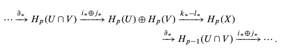

En estas notas demostramos el siguiente resultado clásico de la topología algebraica también conocido como el *"teorema de la bola peluda"*. 

**Teorema.** Existe un campo vectorial no nulo en $S^n$ si y solo si $n$ es impar.

Se dice a partir de este resultado que la esfera $S^2$ *no se puede peinar* continuamente.

### Resultados de homología singular

Sea $X$ un espacio topológico. Denotemos por $C_p(X)$ al **grupo** **singular de cadenas de dimensión** $n$. A los elementos de $C_p(X)$ se les llama **p-cadenas singulares** en $X$. Existe un homomorfismo de grupos $\partial: C_p(X) \rightarrow C_p(X)$ llamado [operador frontera](https://en.wikipedia.org/wiki/Singular_homology#Singular_chain_complex) que satisface que $\partial (\partial c) = 0$ para toda c cadena singular. 

El conjunto $Z_p = \ker \partial$ se le conoce como el **grupo de p-ciclos**, mientras que al conjunto $B_p = \Im \partial$ se le conoce como el **grupo de (p+1)-fronteras.** Debido a la identidad $\partial(\partial c) = 0$, el grupo $B_p(X)$ es un subgrupo de $Z_p(X)$.  Consecuentemente,  el **p-ésimo grupo de homología**, denotado como $H_p(X)$, se define como el cociente de $H_p(X) = Z_p(X) / B_p(X) = \ker \partial_p / \Im \partial_{p+1}$.

Si $f: X \rightarrow Y$ es un mapeo continuo entre espacios topológicos, entonces $f$ induce un homomorfismo de grupos $f_\ast: H_p(X) \rightarrow H_p(Y)$ que satisface las siguientes propiedades functoriales:

1. Si $f: X \rightarrow X$ es la identidad, entonces $f_\ast: H_p(X) \rightarrow H_p(X)$ es el homomorfismo identidad. 
2. Si $f: X \rightarrow Y $ y $g: Y \rightarrow Z$ son mapeos continuos entre espacios topológicos, entonces $(g \circ f)_\ast = g_\ast \circ f_\ast: H_p(X) \rightarrow H_p(Z)$.

Como consecuencia inmediata de lo anterior, tenemos que si $f: X \rightarrow Y$ es un homeomorfismo, entonces $f_\ast: H_p(X) \rightarrow H_p(Y)$ es un isomorfismo de grupos. Por otro lado, si $A \subset X$ es un [retracto]() de $X$, entonces para toda $p$, el homomorfismo $H_p(A) \rightarrow H_p(X)$ inducido por la inclusión es inyectivo.

Un argumento directo muestra que, $H_0(X)$ es un grupo abeliano libre cuya base consiste un punto arbitrario por cada componente conexa de $X$. 

El siguiente resultado establece una relación entre equivalencia homotópica y homología. 

**Teorema.** Si $f, g: X \rightarrow Y$ son mapeos homotópicos, entonces para toda $p \geq 0$, los homomorfismos inducidos $f_\ast, g_\ast: H_p(X) \rightarrow H_p(Y)$ son iguales. 

Como sonsecuencia inmediata se tiene que si $f: X \rightarrow Y$ es una equivalencia homotópica, entonces para toda $p\geq 0$, $f_\ast: H_p(X) \rightarrow H_p(Y)$ es un isomorfismo. En particular, si $X$ es [contraible](https://en.wikipedia.org/wiki/Contractible_space), entonces $H_p(X) = 0$ para toda $p > 0$.

Existe una relación sencilla entre el grupo fundamental $\pi_1(X)$  de un espacio $X$ y su primer grupo de homología $H_1(X)$: el primer grupo de homología de $X$ es la [abelianización](https://en.wikipedia.org/wiki/Commutator_subgroup#Abelianization) del grupo fundamental de $X$.

Consecuentemente, dado que que $\pi_1(S^1) \cong \mathbb Z$, se tiene que $H_1(S^1) \cong \mathbb Z$ y $H_1(S^n) \cong 0$ si $n \geq 2$ [^1]. 

El siguiente teorema nos permite calcular grupos de homología de un espacio $X$, mediante el cálculo grupos de homología de subconjuntos abiertos de $X$. Claro, esta reducción es útil si calcular los grupos de homología de estos abiertos es una tarea más sencilla que calcular los grupos de homología de $X$. Veremos que este es el caso para las n-esferas.

**Teorema (Mayer-Vietoris).** Sea $X$ un espacio topológico y sean $U, V$ subconjuntos abiertos de $X$ cuya unión es $X$. Entonces, para cada $p$  existe un homomorfismo $\partial_\ast: H_p(X) \rightarrow H_{p-1}(U \cap V)$ tal que la siguiente sucesión es [exacta]():

### Homología de la n-esfera y teoría de grado

Con los resultados de la sección anterior estamos listos para calcular los grupos de homologías de la n-esfera. 

**Teorema .** Para $n \geq 1$,  $S^n$ tiene los siguientes grupos de homología:

$$ H_p(S^n) \cong \begin{cases} \mathbb Z & \text{ si } p=0,\\ 0 & \text{ si } 0 < p < n,\\ \mathbb Z & \text{ si } p=n, \\ 0 & \text{ si } p > n. \end{cases}$$

*Demostración.* Sean $p_N$ y $p_S$ el polo norte y sur de $S^n$ respectivamente y sean $U = S^n - \{p_N\}$, $V = S^n - \{p_S\}$. Entonces, por Mayer-Vietores se obtiene la sucesión exacta

$$H_p(U) \oplus H_p(V) \rightarrow H_p(S^n) \rightarrow H_{p-1}(U\cap V) \rightarrow H_{p-1}(U) \oplus H_{p-1}(V).$$ 

Dado que $U$ y $V$ Son contraibles, si $p > 1$ se tiene que 

$$ 0 \rightarrow H_p(S^n) \rightarrow H_{p-1}(U \cap V) \rightarrow 0,$$

lo cual demuestra que $\partial_\ast$ es un isomorfismo. Dado que $U \cap V$ es homotópicamente equivalente a $S^{n-1}$, tenemos que $H_p(S^n) \cong H_{p-1}(S^{n-1})$ para $p>1$, $n \geq 1$.

Probaremos el resultado mediante inducción sobre $n$. Para $n=1$, e

:white_check_mark:

Suponga que $n \geq 1$. Por el Teorema, $H_n(S^n)$ es un grupo cíclico infinito. Si $f: S^n \rightarrow S^n$ es un mapeo continuo, entonces $f$ induce un homomorfismo $f_\ast: H_n(S^n) \rightarrow H_n(S^n)$ de grupos. Todo homomorfismo entre grupos cíclicos es de la forma $g \mapsto g^m$ para algún entero fijo $m$. El entero $m$ que satisface esta propiedad para $f_\ast$ se le llama el **grado de $f$** y se denota por $deg(f).$ En particular, para el caso $n=1$, al grado de $f: S^1 \rightarrow S^1$ se le conoce como [número de enrollamiento]() de $f$. Por tanto, lo anterior representa una generalización de esta noción.  

**Proposición.** Suponga que $n\geq1$ y $f,g : S^n \rightarrow S^n$ son mapeos continuos. Entonces 

1. $deg(g \circ f) = (deg(g)) \cdot (deg(f))$.
2. Si $f$ y $g$ son homotópicos, entonces $deg(f) = deg(g)$.

*Demostración.*

Cabe resaltar que el converso del punto 2. de la proposición también es cierto. Por tanto, el grado nos ofrece una clasificación homotópica de mapeos de $S^n$ en $S^n$ [^1].

Calculemos el grado de algunos mapeos elementales entre esferas. Sea $Id_{S^n}: S^n \rightarrow S^n$ el mapeo identidad. 

[^1]: Ver por ejemplo [Propiedades de levantamientos]()

---