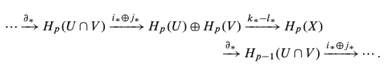

En estas notas demostramos el siguiente resultado clásico de la topología algebraica también conocido como el *"teorema de la bola peluda"*. 

**Teorema.** Existe un campo vectorial no nulo en $S^n$ si y solo si $n$ es impar.

Se dice a partir de este resultado que la esfera $S^2$ *no se puede peinar* continuamente.

### Algunos resultados de homología singular

La teoría de homología establece métodos para asociar un invariante algebraico a un espacio topológico. Este invariante se lo conoce como grupo de homología. A diferencia del grupo fundamental y sus generalizaciones dimensiones superiores, calcular los grupos de homología es relativamente sencillo. Sin embargo, como muchas otras cosas, nada es gratis: lo que ganamos en facilidad de cómputo lo perdemos en claridad de los conceptos. 

En lo siguiente presentamos algunas definiciones y teoremas elementales (algunos sin demostración) de homología singular (para ver más detalles, consultar [1]).

Para todo entero $p\geq 0$, sea $\Delta_p \subset \mathbb R^p$ el **p-simplejo estandar** $[e_0, e_1, \ldots, e_p]$ con $e_0 = 0$ y, para $1 \leq i \leq p$, $e_i = (0, \ldots, 1, \ldots 0)$ representa el vector con todas sus coordenadas igual a 0 excepto por la coordenada $i$, que es igual a $1$. Si $X$ es un espacio topológico, el **p-simplejo singular** en $X$ es un mapeo continuo $\sigma: \Delta_p \rightarrow X$.

Sea $C_p(X)$ el [grupo abeliano libre]() sobre el conjunto de todos los p-simplejos en $X$. Todo elemento de $C_p(X)$ puede escribirse como una combinación lineal formal de complejos singulares, donde los coeficientes son enteros, es decir, los elementos de $C_p(X)$ son de la forma

$$ \sum_{j} a_j \sigma_j,  \ \ \text{ con } a_j \in \mathbb Z \text{ y } \sigma_j \text{ p-simplejo singular.}$$

A los elementos de $C_p(X)$ se les llama **p-cadenas singulares** en $X$ y al grupo $C_p(X)$ se le llama **grupo singular de cadenas de dimensión p.**

Sean $v_0, \ldots, v_p \in \mathbb R^n$ y sea $A(v_0, \ldots, v_p): \Delta_p \rightarrow \mathbb R^n$ el mapeo afín que satisface $e_i \mapsto v_i$ para $i=0, \ldots, p$. Sea $F_{i,p}: \Delta_{p-1} \rightarrow \Delta_p$ definido como

$$F_{i,p} = A(e_0, \ldots, \hat{e_i}, \ldots, e_p),$$

para $i=0, \ldots, p$. Es decir, el mapeo $F_{i, p}$ satisface

$$\begin{eqnarray} e_0 &\mapsto& e_0 \\ \cdots & & \cdots\\ e_{i-1} & \mapsto & e_{i-1} \\ e_i &\mapsto &e_{i+1} \\ \cdots & & \cdots \\ e_{p-1} &\mapsto& e_p. \end{eqnarray}$$

Con lo anterior, podemos definir el **mapeo frontera** $\partial: C_p(X) \rightarrow C_{p-1}(X)$ de la siguiente manera: para $\sigma: \Delta_p \rightarrow X$ en $C_p(X)$, definimos una $(p-1)-$cadena $\partial \sigma$, llamada **la frontera de** $\sigma$,  como

$$\partial \sigma = \sum_{i=0}^p (-1)^i \sigma \circ F_{i,p} $$

 Por convención, la frontera de cualqueir $0-$cadena es cero. Este mapeo es homomorfismo de grupos.

Una $p-$cadena $c$ es un **ciclo** si $\partial c = 0$. Y si existe una $(p+1)$-cadena $b$ tal que $\partial b = c$, decimos que $c$ es una **frontera.** El conjunto $Z_p(X)$ de todos los $p-$ciclos es un subgrupo de $C_p(X)$, ya que es el kernel del homomorfismo $\partial_p$. Similarmente, el conjunto de $p$-fronteras $B_p(X)$ es también un subgrupo, pues es la imagen de $\partial_{p+1}$. 

El mapeo frontera satisface la siguiente propiedad. Si $c$ es una cadena singular, entonces $\partial (\partial c) = 0$ :exclamation:. En otras palabras, *la frontera de una frontera es 0*. Debido a esto, el grupo $B_p(X)$ de $p-$fronteras es un subgrupo de $Z_p(X)$ el grupo de $p-$ciclos. Por tanto,

**Definición.** El **p-ésimo grupo de homología singular** de $X$ se define como el cociente

$$H_p(X) = Z_p(X) / B_p(X) = \ker \partial p / \Im \partial_{p+1}.$$

 Dado un mapeo continuo $f: X \rightarrow Y$, podemos definir un homomorfismo $f_{\sharp}: C_p(X) \rightarrow C_p(Y)$ como $f_\sharp \sigma = f \circ \sigma$ para todo $p-$simplejo $\sigma$. El mapeo $f_\sharp$ satisface 

$$f_\sharp(\partial \sigma) = \partial (f_\sharp \sigma),$$

por lo que $f_\sharp$ mapea  $Z_p(X)$ en $Z_p(Y)$ y $B_p(X)$ en $B_p(Y)$. Luego, $f_\sharp$ pasa al cociente induciendo un homomorfismo $f_\ast: H_p(X) \rightarrow H_p(X)$. Este homomorfismo satisface las siguientes propiedades functoriales. 

**Teorema.** 

**Teorema (Mayer-Vietoris).** Sea $X$ un espacio topológico y sean $U, V$ subconjuntos abiertos de $X$ cuya unión es $X$. Entonces, para cada $p$  existe un homomorfismo $\partial_\ast: H_p(X) \rightarrow H_{p-1}(U \cap V)$ tal que la siguiente sucesión es exacta:

**Teorema .** Para $n \geq 1$,  $S^n$ tiene los siguientes grupos de homología:

$$ H_p(S^n) \cong \begin{cases} \mathbb Z & \text{ si } p=0,\\ 0 & \text{ si } 0 < p < n,\\ \mathbb Z & \text{ si } p=n, \\ 0 & \text{ si } p > n. \end{cases}$$

*Demostración.* Sean $p_N$ y $p_S$ el polo norte y sur de $S^n$ respectivamente y sean $U = S^n - \{p_N\}$, $V = S^n - \{p_S\}$. Entonces, por Mayer-Vietores se obtiene la sucesión exacta

$$H_p(U) \oplus H_p(V) \rightarrow H_p(S^n) \rightarrow H_{p-1}(U\cap V) \rightarrow H_{p-1}(U) \oplus H_{p-1}(V).$$ 

Dado que $U$ y $V$ Son contraibles, si $p > 1$ se tiene que 

$$ 0 \rightarrow H_p(S^n) \rightarrow H_{p-1}(U \cap V) \rightarrow 0,$$

lo cual demuestra que $\partial_\ast$ es un isomorfismo. Dado que $U \cap V$ es homotópicamente equivalente a $S^{n-1}$, tenemos que $H_p(S^n) \cong H_{p-1}(S^{n-1})$ para $p>1$, $n \geq 1$.

Probaremos el resultado mediante inducción sobre $n$. Para $n=1$, e

:white_check_mark:

### Teoría de grado para esferas

Suponga que $n \geq 1$. Por el Teorema, $H_n(S^n)$ es un grupo cíclico infinito. Si $f: S^n \rightarrow S^n$ es un mapeo continuo, entonces $f$ induce un homomorfismo $f_\ast: H_n(S^n) \rightarrow H_n(S^n)$ de grupos. Todo homomorfismo entre grupos cíclicos es de la forma $g \mapsto g^m$ para algún entero fijo $m$. El entero $m$ que satisface esta propiedad para $f_\ast$ se le llama el **grado de $f$** y se denota por $deg(f).$ En particular, para el caso $n=1$, al grado de $f: S^1 \rightarrow S^1$ se le conoce como [número de enrollamiento]() de $f$. Por tanto, lo anterior representa una generalización de esta noción.  

**Proposición.** Suponga que $n\geq1$ y $f,g : S^n \rightarrow S^n$ son mapeos continuos. Entonces 

1. $deg(g \circ f) = (deg(g)) \cdot (deg(f))$.
2. Si $f$ y $g$ son homotópicos, entonces $deg(f) = deg(g)$.

*Demostración.*

Cabe resaltar que el converso del punto 2. de la proposición también es cierto. Por tanto, el grado nos ofrece una clasificación homotópica de mapeos de $S^n$ en $S^n$ [^1].

Calculemos el grado de algunos mapeos elementales entre esferas. Sea $Id_{S^n}: S^n \rightarrow S^n$ el mapeo identidad. 

### Resultado principal

[^1]: Ver también las notas [*Clasificación homotópica de mapeos en el toro*]().

---